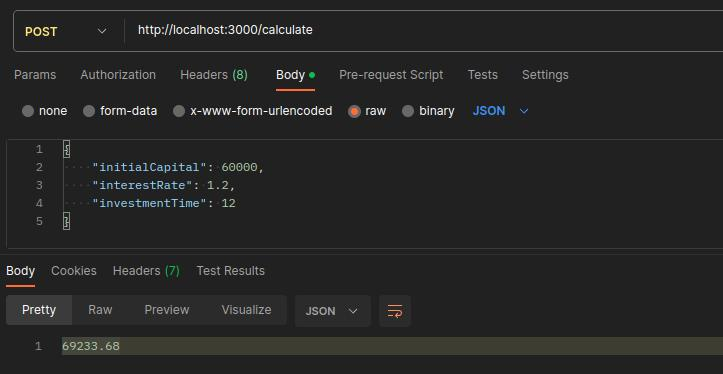

<strong><h1 align="center">Interest Calculation</h1></strong>
<p align="center"><strong>Project developed for a technical challenge/test</strong></p>

<p align="center">
  
</p>

## 🚀 Challenge
Create a function that calculates the final value of an investment based on initial capital, interest rate, and investment time (in months). The program must prompt the user for these values and display the final value.

## 🛰️ Technologies
This project was developed with the following technologies:

- Node.js
- Express
- Jest
## 💻 Installation / How to use
- Clone this repository:
   ```bash
   git clone https://github.com/jairokoning/interest-calculation-api.git
   ```
- Install dependencies:
   ```bash
   yarn install
   ```
- Start the application
   ```bash
   yarn dev
   ```
- Run tests
   ```bash
   yarn test
   ```
- Execute http://localhost:3000/calculate on a API Client for REST (Insomnia, Postman...)
- Send the investment information in the following format in the body of the post request for get the final value of investment
   ```json
   {
    "initialCapital": 60000,
    "interestRate": 1.2,
    "investmentTime": 12
   }
   ```
---

_Developed with_ 😀 _and_ ❤️ _by [Jairo Koning](https://linkedin/in/jairokoning)_